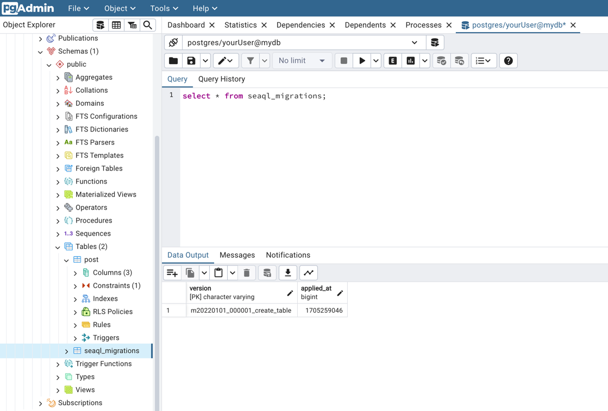
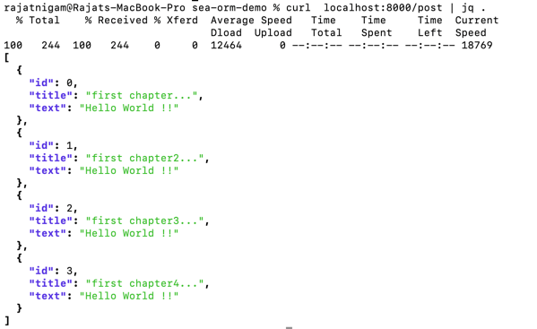
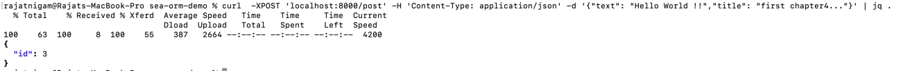
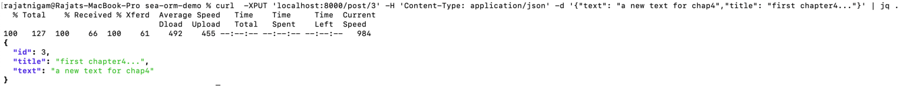
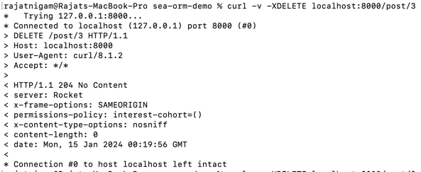

# Microservice using Rust, Sea Orm and Rocket

## Bootstrap postgres database along with pgAdmin
`podman-compose up`

## Install migration tool
`cargo install sea-orm-cli`

## Verify migration tool setup
`sea-orm-cli --help`

## Initialize migration crate
`sea-orm-cli migrate init`

## Execute migration
`sea-orm-cli migrate -u postgresql://<USERNAME>:<PASSWORD>@localhost:5432/postgres`

## Tables Created Successfully
- post
- seaql_migrations

## Reverse generate the entity structs in src/entities directory
`sea-orm-cli generate entity -u postgresql://<USERNAME>:<PASSWORD>@localhost:5432/postgres -o src/entities`

## Get all posts
`curl  localhost:8000/post | jq .`

## Create a post
`curl  -XPOST 'localhost:8000/post' -H 'Content-Type: application/json' -d '{"text": "Hello World !!","title": "first chapter4..."}' | jq .`

## Update a record
`curl  -XPUT 'localhost:8000/post/3' -H 'Content-Type: application/json' -d '{"text": "a new text for chap4","title": "first chapter4..."}' | jq .`

## Delete a record
`curl -v -XDELETE localhost:8000/post/3`

